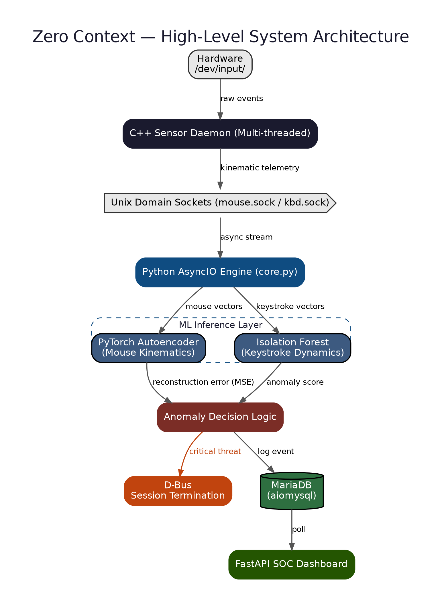
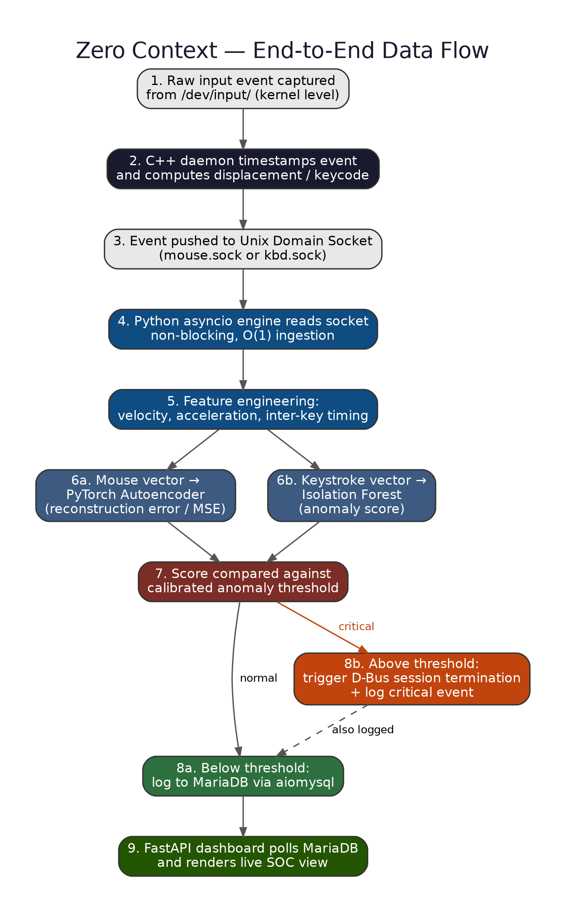
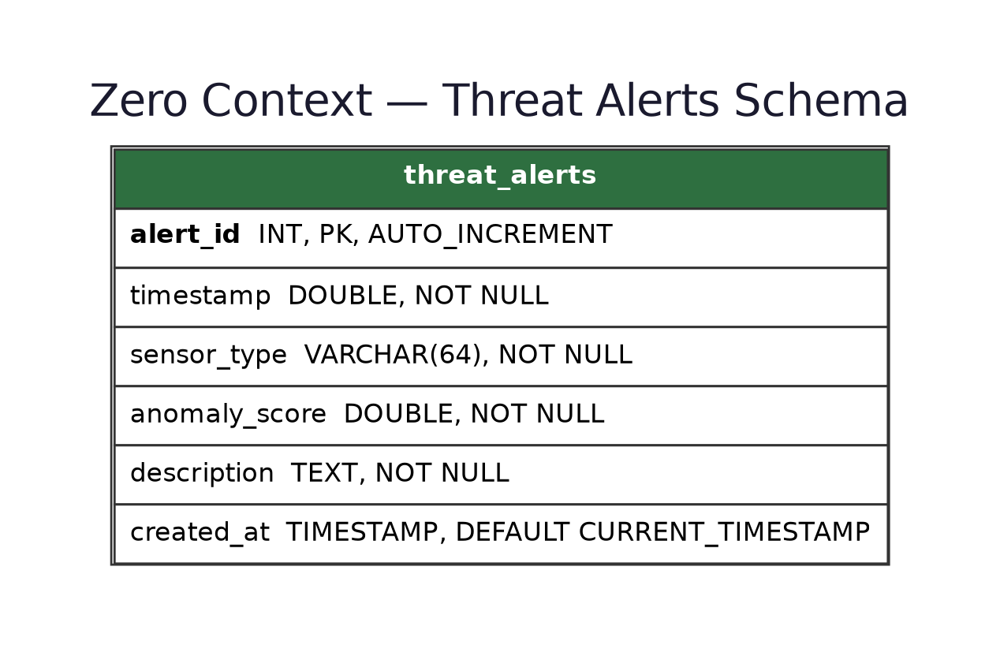
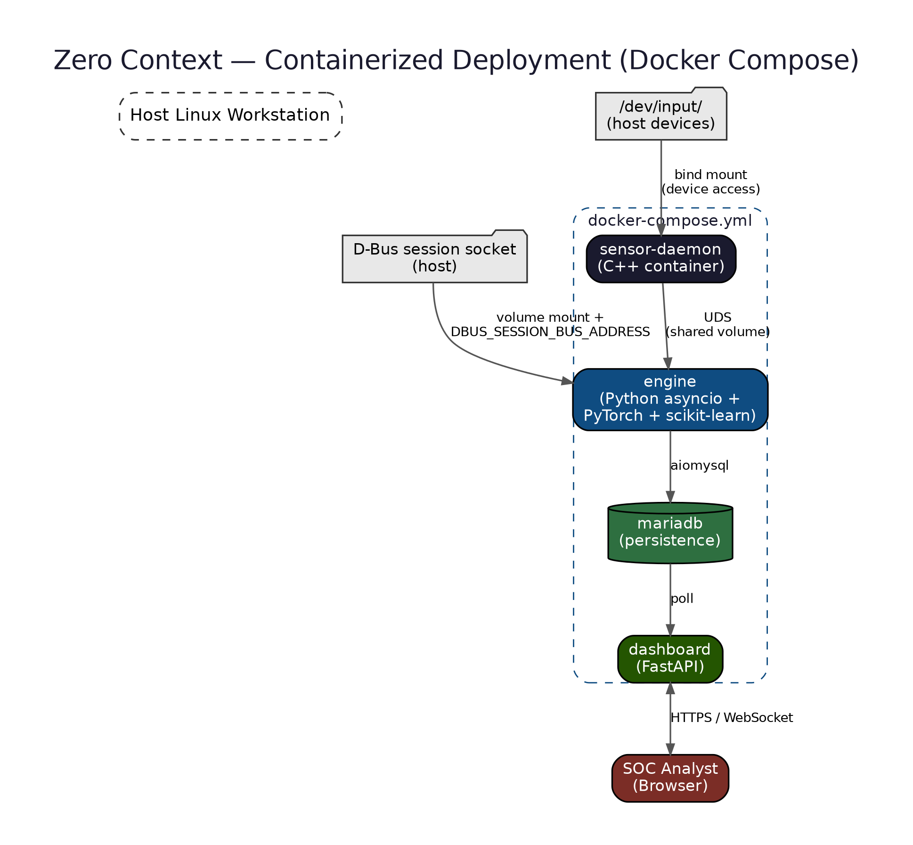

# ⚡ Zero Context

<p align="center">
  
  
  
  
</p>

<p align="center">
  <strong>Low-Level Sensing • Intelligent Processing • Real-Time Monitoring</strong>
</p>

<p align="center">
  <i>A high-performance hybrid system that combines C++ system sensing with Python-based intelligence and orchestration.</i>
</p>

<p align="center">
  <a href="docs/Zero_Context_Project_Report.pdf"><b>📄 Full Report</b></a> •
  <a href="docs/Zero_Context_Project_Synopsis.pdf"><b>📄 Synopsis</b></a> •
  <a href="#-documentation"><b>📚 Docs</b></a>
</p>

---

## 🧭 Overview

**Zero Context** is a standalone, independently architected system designed around a simple principle:

> **Capture data fast. Process it intelligently. Observe it in real time.**

The system combines two specialized subsystems:

### 🔹 Sensor Node

A high-performance **C++ daemon** responsible for low-level data sensing and collection.

It is designed to:

* Capture raw system or network telemetry
* Perform low-level sensing with minimal overhead
* Operate as a background daemon
* Forward collected data through **Inter-Process Communication (IPC)**

### 🔹 Intelligence Engine

A **Python-based processing and orchestration layer** responsible for:

* Receiving sensor data
* Processing and routing telemetry
* Running machine-learning pipelines
* Persisting historical data
* Managing application logging
* Providing a real-time monitoring dashboard

This separation allows the high-speed sensing layer to remain independent from computationally heavier analytical workloads.

---

## 📚 Documentation

Full write-ups, diagram, and reference material live in [`/docs`](docs/):

| Document | Description |
|---|---|
| [📄 Project Report](docs/Zero_Context_Project_Report.pdf) | Full academic report — background, architecture, implementation, testing, and extreme-load benchmarks |
| [📄 Project Synopsis](docs/Zero_Context_Project_Synopsis.pdf) | Condensed synopsis — problem statement, objectives, methodology, and expected outcomes |
| [🎨 Cover Page](docs/Zero_Context_Cover_Page.png) | Themed title page used across the report and synopsis |

**Architecture & design diagram** ([`/docs/diagram`](docs/diagram/)):

<p align="center">
  
</p>

<details>
<summary><b>More diagram — data flow, database schema, deployment</b></summary>
<br>

**End-to-end data flow**


**Database schema**


**Containerized deployment (Docker Compose)**


</details>

---

# 🏗️ Architecture

```text
                         ┌─────────────────────────┐
                         │       SYSTEM / NETWORK  │
                         │        DATA SOURCES     │
                         └────────────┬────────────┘
                                      │
                                      ▼
                    ┌─────────────────────────────────┐
                    │         C++ SENSOR NODE         │
                    │                                 │
                    │  sensor.cpp                     │
                    │  sensor_daemon.cpp              │
                    │                                 │
                    │  • Low-level sensing             │
                    │  • Data collection               │
                    │  • Daemon process                │
                    └───────────────┬─────────────────┘
                                    │
                                    │ IPC
                                    ▼
                    ┌─────────────────────────────────┐
                    │       PYTHON INTELLIGENCE       │
                    │             ENGINE              │
                    │                                 │
                    │  core.py                        │
                    │  database.py                    │
                    │  logger.py                      │
                    │  train_pipeline.py              │
                    │                                 │
                    │  • Data processing               │
                    │  • ML pipelines                  │
                    │  • Persistence                   │
                    │  • Logging                       │
                    └───────────────┬─────────────────┘
                                    │
                         ┌──────────┴──────────┐
                         │                     │
                         ▼                     ▼
                ┌─────────────────┐   ┌─────────────────┐
                │    DATABASE     │   │    DASHBOARD    │
                │                 │   │                 │
                │ Historical Data │   │ Real-Time UI    │
                │ Logs / Events   │   │ System Metrics  │
                └─────────────────┘   └─────────────────┘
```

### Design Philosophy

The architecture follows **separation of concerns**:

```text
C++  →  Sense
IPC  →  Transport
Python → Process
ML   →  Learn
DB   →  Persist
Web  →  Observe
```

This prevents analytical workloads from directly interfering with the high-speed sensing layer.

---

# 📁 Project Structure

```text
Zero_Context/
│
├── docs/
│   ├── Zero_Context_Project_Report.pdf
│   ├── Zero_Context_Project_Synopsis.pdf
│   ├── Zero_Context_Cover_Page.pdf
│   └── diagram/
│       ├── architecture.png
│       ├── dataflow.png
│       ├── database_schema.png
│       └── deployment.png
│
├── config.py
│   └── Global configuration and environment variables
│
├── dashboard.py
│   └── Web server and dashboard application
│
├── main.py
│   └── Primary application entry point
│
├── engine/
│   ├── __init__.py
│   │   └── Python package initialization
│   │
│   ├── core.py
│   │   └── Core processing and data routing
│   │
│   ├── database.py
│   │   └── Database connection and persistence layer
│   │
│   ├── logger.py
│   │   └── Centralized application logging
│   │
│   └── train_pipeline.py
│       └── Machine-learning training pipeline
│
├── sensor/
│   ├── sensor.cpp
│   │   └── Core sensing and data collection
│   │
│   └── sensor_daemon.cpp
│       └── Daemonization and IPC logic
│
└── templates/
    └── index.html
        └── Dashboard interface
```

> **Note:** The structure above represents the independent architecture of the **Zero Context** repository. No legacy project architecture or unrelated modules are required.

---

# ✨ Core Components

## 📡 `sensor/sensor.cpp`

The low-level sensing component.

Responsibilities include:

* System/network data capture
* Raw telemetry collection
* Low-level data acquisition
* Preparing data for transmission to the processing layer

The component is implemented in **C++** to provide efficient low-level execution.

---

## ⚙️ `sensor/sensor_daemon.cpp`

The daemon layer responsible for running the sensor as a background process.

Responsibilities include:

* Background execution
* Sensor lifecycle management
* IPC handling
* Communication with the Python intelligence layer

Together, `sensor.cpp` and `sensor_daemon.cpp` form the **Sensor Node**.

---

## 🧠 `engine/core.py`

The central intelligence component.

It acts as the processing layer between the sensor and the rest of the system.

```text
Sensor Data
     │
     ▼
  Receive
     │
     ▼
  Process
     │
     ├──────────────► Database
     │
     ├──────────────► ML Pipeline
     │
     └──────────────► Dashboard
```

---

## 🤖 `engine/train_pipeline.py`

Dedicated machine-learning training pipeline.

The module can be executed independently to:

* Prepare training data
* Train models
* Update model artifacts
* Support the analytical layer before deployment

Keeping training separate from the main runtime allows the intelligence engine to remain focused on processing and orchestration.

---

## 🗄️ `engine/database.py`

The persistence layer.

Responsible for:

* Database connectivity
* Sensor data persistence
* Historical records
* Query operations
* Storage required by the processing layer

The actual database backend is controlled through project configuration.

---

## 📝 `engine/logger.py`

Centralized logging infrastructure.

It provides standardized logging for:

* Runtime events
* Errors
* System activity
* Processing events
* Anomalies

For production deployments, logs should be stored in a restricted directory with appropriate filesystem permissions.

---

## 📊 `dashboard.py`

The web-facing monitoring layer.

The dashboard provides a visual interface for observing:

* System health
* Sensor activity
* Collected metrics
* Processing status
* Pipeline state

The HTML interface is provided through:

```text
templates/index.html
```

---

# 🧰 Technology Stack

| Layer          | Technology                              | Purpose                            |
| -------------- | ---------------------------------------- | ----------------------------------- |
| Sensor         | **C++**                                 | High-performance low-level sensing |
| Sensor Capture | **libpcap / system APIs**               | Data acquisition where applicable  |
| IPC            | **IPC mechanism configured by project** | Sensor → Engine communication      |
| Intelligence   | **Python**                              | Processing and orchestration       |
| ML             | **Scikit-learn / ML framework**         | Model training and analysis        |
| Database       | **SQLite / MySQL**                      | Persistent storage                 |
| Backend        | **Flask / configured web framework**    | Dashboard server                   |
| Frontend       | **HTML**                                | Monitoring interface               |
| Logging        | **Python logging**                      | Runtime and security events        |

---

# ⚙️ Requirements

Before running the project, ensure the environment contains:

### Required

* **Python 3.8+**
* **C++ compiler**

  * GCC / `g++`
  * or Clang
* **Git**
* Configured database backend
* Required Python packages

### Recommended Environment

The project can be developed and tested in environments such as:

* 🐧 Linux
* 🐉 Kali Linux
* 🪟 Windows with an appropriate development environment
* Linux/Windows dual-boot setups

> Low-level network/system sensing may require elevated privileges depending on the operating system and capture mechanism.

---

# 🚀 Installation

## 1️⃣ Clone the Repository

```bash
git clone https://github.com/yourusername/Zero_Context.git
cd Zero_Context
```

---

## 2️⃣ Configure Python Environment

Creating a virtual environment is recommended:

```bash
python -m venv .venv
```

### Linux / macOS

```bash
source .venv/bin/activate
```

### Windows

```powershell
.venv\Scripts\activate
```

Install the project's Python dependencies:

```bash
pip install -r requirements.txt
```

> If the repository does not yet contain `requirements.txt`, install the dependencies defined by the project configuration.

---

## 3️⃣ Configure `config.py`

Update:

```text
config.py
```

with the required environment-specific configuration.

Typical configuration areas include:

```text
Database
IPC / Socket configuration
Model configuration
Dashboard port
Logging paths
Runtime parameters
```

**Do not commit credentials, API keys, or other secrets to GitHub.**

Copy `.env.example` to `.env` and fill in real values — `config.py` loads these automatically via `python-dotenv`:

```bash
cp .env.example .env
```

`.env` is already listed in `.gitignore`.

---

# 🔨 Build the Sensor

Navigate to the sensor directory:

```bash
cd sensor
```

Compile the sensor components:

```bash
g++ -O3 -o sensor_daemon sensor.cpp sensor_daemon.cpp
```

Return to the repository root:

```bash
cd ..
```

If the implementation depends on external libraries such as `libpcap`, install the required development package and link the corresponding library during compilation.

For example:

```bash
g++ -O3 -o sensor_daemon sensor.cpp sensor_daemon.cpp -lpcap
```

---

# 🧠 Train the Initial Model

If the project requires an initial model before runtime, execute:

```bash
python engine/train_pipeline.py
```

The training pipeline is intentionally separated from the runtime engine so models can be prepared or updated independently.

---

# ▶️ Running Zero Context

The complete system consists of multiple cooperating processes.

## 1. Start the Sensor Node

From the repository root:

```bash
sudo ./sensor/sensor_daemon
```

Elevated privileges may be required depending on what the sensor captures.

---

## 2. Start the Intelligence Engine

Open another terminal:

```bash
python main.py
```

The main application initializes the Python processing layer and orchestrates the intelligence pipeline.

---

## 3. Start the Dashboard

Open another terminal:

```bash
python dashboard.py
```

The dashboard will listen on the port configured in:

```text
config.py
```

Then open:

```text
http://localhost:<PORT>
```

in your browser.

---

# 🔄 Runtime Data Flow

The complete runtime pipeline can be summarized as:

```text
┌──────────────┐
│ Data Source  │
└──────┬───────┘
       │
       ▼
┌──────────────┐
│ C++ Sensor   │
│    Node      │
└──────┬───────┘
       │
       │ IPC
       ▼
┌──────────────┐
│ Python Core  │
│   Engine     │
└──────┬───────┘
       │
       ├───────────────┐
       ▼               ▼
┌──────────────┐  ┌──────────────┐
│ ML Pipeline  │  │   Database   │
└──────┬───────┘  └──────┬───────┘
       │                  │
       └────────┬─────────┘
                ▼
        ┌──────────────┐
        │  Dashboard   │
        └──────────────┘
```

A step-by-step breakdown of this pipeline, including the ML scoring and mitigation decision logic, is diagrammed in [`docs/diagram/dataflow.png`](docs/diagram/dataflow.png) and covered in Chapter 5 of the [Project Report](docs/Zero_Context_Project_Report.pdf).

---

# 🔐 Security & Logging

Security and operational visibility are fundamental to the system.

The logging layer is centralized through:

```text
engine/logger.py
```

It is recommended to:

* Restrict access to log directories
* Avoid storing secrets in logs
* Rotate large log files
* Separate operational and security events where appropriate
* Apply least-privilege permissions
* Protect database credentials
* Keep sensitive configuration outside version control

### Environment Secrets

Never commit sensitive values such as:

```text
Passwords
API Keys
Database Credentials
Private Tokens
Encryption Keys
```

Use environment variables or a secure secrets-management mechanism instead.

---

# 🧩 Design Principles

Zero Context is built around several engineering principles.

### ⚡ Performance

Low-level data sensing is delegated to compiled C++ code.

### 🧱 Separation of Concerns

Sensing, processing, persistence, learning, and visualization remain independently organized.

### 🔌 Modular Architecture

Each subsystem has a clearly defined responsibility and can evolve independently.

### 🧠 Intelligence

Machine-learning pipelines can be developed and executed independently of the sensor layer.

### 📊 Observability

Persistent data and centralized logging provide visibility into system behavior.

### 🔄 Extensibility

The architecture is designed to allow additional sensors, processing modules, models, and dashboard components to be introduced without redesigning the entire system.

---

# 🔧 Recent Hardening Pass

* **Fixed:** `train_models()` now runs from a `finally` block in `main.py` — previously it was unreachable because `KeyboardInterrupt` was caught before it could execute.
* **Added:** `.env` / `.env.example` for DB credentials and dashboard API key — nothing sensitive is hardcoded in `config.py` anymore.
* **Added:** API-key auth (`X-API-Key` header, `ZC_DASHBOARD_API_KEY`) on `/api/alerts`. The endpoint fails closed (503) if no key is configured.
* **Added:** Centralized rotating-file logging (`engine/log_setup.py`) replacing scattered `print()` calls in `main.py`, `engine/core.py`, `engine/database.py`, `engine/train_pipeline.py`, and `dashboard.py`.
* **Added:** Checked `send()`/`connect()` in `sensor_daemon.cpp` with auto-reconnect on a dropped UDS socket, instead of silently dropping events.
* **Added:** `Dockerfile` + `docker-compose.yml` (dashboard + MySQL, with schema auto-applied from `sql/init.sql`). The C++ sensor daemon still runs on the host — it needs raw `/dev/input` access and `sudo`, which containers can't do safely.
* **Added:** GitHub Actions CI (`.github/workflows/ci.yml`) that compiles the sensor daemon and byte-compiles/import-checks the Python engine on every push/PR.
* **Known issue, not yet fixed:** `sensor/sensor.cpp` (the Windows-hook variant) has multiple syntax errors and undeclared identifiers — it won't compile as-is. The Linux daemon (`sensor_daemon.cpp`) is the working implementation.

---

# 🗺️ Future Roadmap

Potential future improvements include:

* [ ] Fix or remove the incomplete `sensor.cpp` Windows variant
* [ ] Additional sensor modules
* [ ] More efficient IPC mechanisms
* [ ] Distributed sensor nodes
* [ ] Advanced anomaly-detection models
* [ ] Real-time alerting (beyond console/log warnings)
* [x] Authentication and authorization for the dashboard
* [x] Containerized deployment (dashboard + DB)
* [ ] Automated model retraining on a schedule
* [ ] Metrics and observability integration (Prometheus/Grafana)
* [ ] Horizontal scaling of processing nodes
* [ ] Centralized multi-device management
* [ ] Automated test suite (pytest) for `engine/`

---

# 🤝 Contributing

Contributions, suggestions, and technical discussions are welcome.

A typical contribution workflow:

```bash
git checkout -b feature/your-feature
```

Make your changes, test them, and commit:

```bash
git add .
git commit -m "feat: add your feature"
```

Then push your branch:

```bash
git push origin feature/your-feature
```

Open a Pull Request and describe:

* What changed
* Why it was changed
* How it was tested
* Any architectural considerations

---

# 📜 License

Add the project's chosen license here.

For example:

```text
MIT License
```

---

# 👨‍💻 Author

**Abhinandan**

Computer Science & Engineering Student
Cybersecurity • System Engineering • Machine Learning

---

<p align="center">

### ⚡ Sense. Process. Learn. Observe.

<i>Zero Context — engineered for high-performance data sensing and intelligent processing.</i>

</p>
